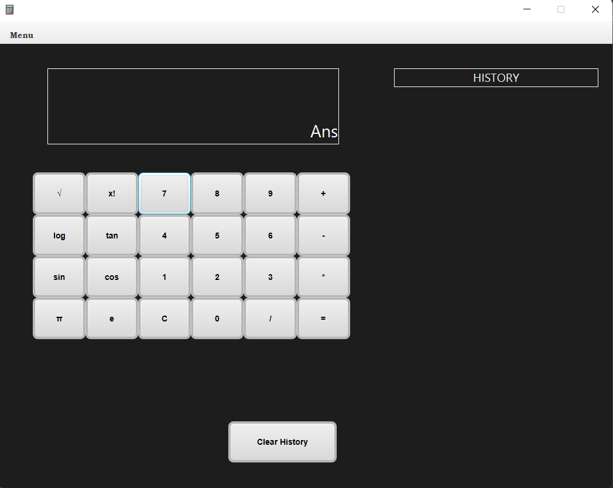
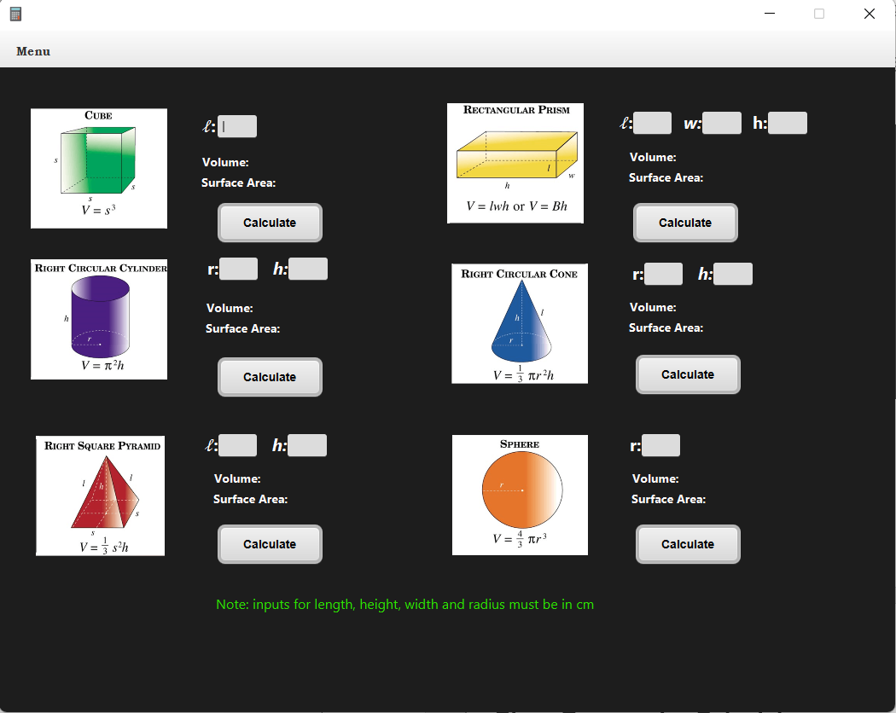
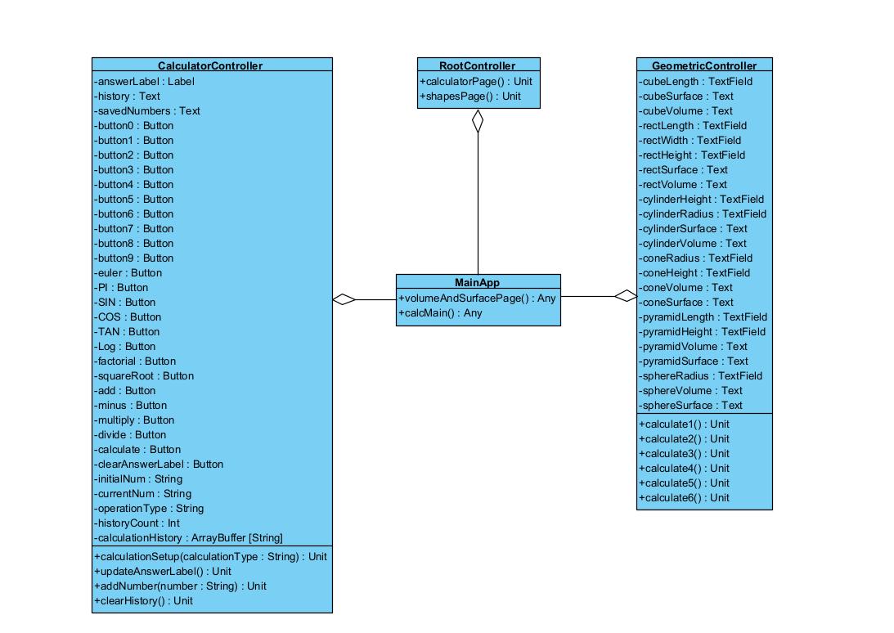

# Scientific-Calculator
Scientific calculator app that was developed using the scalaFX graphical user interface. The scientific calculator can perform the basic operations such as addition, subtraction, multiplication and division. It is also able to perform the advanced functions such as factorial, sine, cosine, tangent, logarithm of base 10 and square root. The calculator also consists of two constants which are the PI constant and the Euler’s number constant. The other part of this app is the Volume and surface area page. This page allows the user to calculate the volume and surface area of a cube, cuboid, cylinder, cone, pyramid and a sphere.

## Class Diagram

This program is comprised of 4 classes:
- Calculator Controller Class:
  - The calculator controller class is responsible for keeping track of all the functions, variable and the main logic behind the Scientific calculator part of this app.
- Root Controller Class:
  -	The root controller class is kept track of the menu bar which controls the two pages of this app.
- Geometric Controller Class:
  - The geometric class keeps track of the calculations, inputs and buttons in the volume and surface area page.
- Main App Class:
  - The main app class is the main class which is responsible for running the program/App.

## Usage:

- Firstly, make sure the java version in your computer is java version 8 
- Then, navigate to the folder which contains the jar file  ***Calculator_18115782.jar*** in command prompt/terminal.
- Run the jar file by typing  ***java -jar Calculator_18115782.jar*** in cmd/terminal to run the program.

